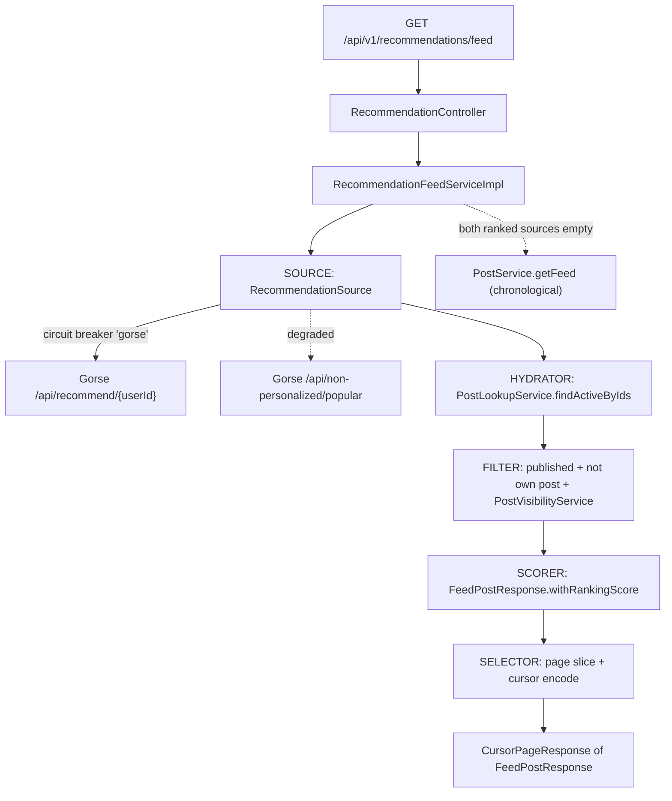
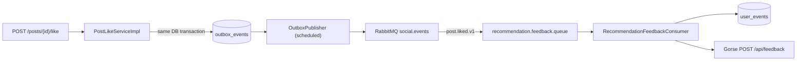

# Recommendation Module

Personalized "for you" post feed backed by [Gorse](https://github.com/gorse-io/gorse), an open-source recommender engine.

The application does not train models itself.
It records engagement as behavioral events, forwards them to Gorse, and reads back a ranked candidate list that it hydrates, filters, and pages.

Data-layer contracts for this module live in [DATA_RULES.md](DATA_RULES.md).
The verified Gorse API contract and its deployment live in [`gorse/README.md`](../../../gorse/README.md).

---

## 1. What it provides

| Capability | Entry point |
|---|---|
| Personalized ranked feed | `GET /api/v1/recommendations/feed` |
| Engagement capture (like, save, comment) | `recommendation.feedback.queue` consumer |
| Behavioral event log | `user_events` table (append-only, month-partitioned) |
| Graceful degradation when the recommender is down | popularity ranking, then the chronological following feed |

The pre-existing chronological feed at `GET /api/v1/posts/feed` is untouched.
The two endpoints coexist: "Following" (chronological) and "For You" (ranked).

---

## 2. Architecture

Gorse runs as a separate container and is reached only over REST.
No domain code depends on Gorse internals, so the engine can be replaced without touching the post or social modules.

### Read path

The pipeline is split into explicit stages so each concern is independently testable.



The **filter** stage is what makes the ranked list safe to serve.
Gorse knows nothing about blocks, private accounts, or post status, so every candidate it returns is re-checked against `PostVisibilityService` and the `PUBLISHED` status before it reaches the client.
The viewer's own posts are also dropped.

Because filtering removes candidates, the service over-fetches (`app.gorse.recommend-multiplier`, default 2x) and loops up to 5 source round trips until the page is full.

### Write path

Engagement never calls Gorse synchronously.
It goes through the existing transactional outbox so a recommender outage can never fail a user's like or save.



`user_events` is the canonical record.
Gorse holds only derived state, so it can always be rebuilt from PostgreSQL by re-pushing (see §7).

---

## 3. Source layout

```text
src/main/java/com/app/modules/recommendation/
├── api/RecommendationApi.java                 # OpenAPI contract + @RequestMapping
├── controller/RecommendationController.java   # auth, rate limiting, response envelope
├── client/
│   ├── GorseClient.java                       # REST contract
│   ├── impl/GorseClientImpl.java              # RestClient calls, no fallback logic
│   └── dto/                                   # Gorse wire records (PascalCase JSON)
├── config/
│   ├── GorseProperties.java                   # app.gorse.* binding
│   └── GorseClientConfig.java                 # RestClient bean, default headers, timeouts
├── consumer/RecommendationFeedbackConsumer.java
├── messaging/RecommendationRabbitBindingConfig.java
├── repository/UserEventJdbcRepository.java    # append-only writer, plain JDBC
└── service/
    ├── RecommendationFeedService.java
    └── impl/
        ├── RecommendationFeedServiceImpl.java # orchestration, cursor, fallback chain
        ├── UserEventsPartitionJob.java        # monthly partition maintenance
        └── feed/RecommendationSource.java     # candidate source + circuit breaker
```

Cross-module access is restricted to service interfaces (`PostLookupService`, `PostVisibilityService`, `PostService`).
`PostLookupService` was added to the post module specifically so this module never reaches into another module's repositories or `impl` package.

---

## 4. API

### `GET /api/v1/recommendations/feed`

Requires authentication.
Rate limiter: `highTraffic`.

| Parameter | Type | Default | Notes |
|---|---|---|---|
| `cursor` | string | none | Opaque cursor from the previous page |
| `limit` | int | 20 | Clamped to 1–100 |

Returns `ApiResponse<CursorPageResponse<FeedPostResponse>>`.
`FeedPostResponse.rankingScore` carries the recommender score and decreases down the page; it is `null` on chronological-fallback pages.

**Cursor format** — base64 of `<source>:<offset>`, where source is `g` (Gorse personalized) or `p` (popularity).
`g:0` encodes to `Zzow`.
A cursor that does not match this shape is treated as a chronological-feed cursor and delegated to `PostService.getFeed`, so pagination survives a mid-scroll fallback.

---

## 5. Feedback mapping

Gorse classifies feedback by **type**, not by numeric weight.
`like`, `save`, and `comment` are configured as positive types; `read` is configured as the read type, in `gorse/config/config.toml`.

| App event | Gorse `FeedbackType` | `user_events.event_type` |
|---|---|---|
| `post.liked.v1` | `like` | `post_like` |
| `post.saved.v1` | `save` | `post_save` |
| `comment.created.v1` | `comment` | `post_comment` |
| `post.viewed.v1` | `read` | `post_view` |

`post.viewed.v1` is published by `POST /api/v1/posts/{postId}/view` (post module) and is the only read-class signal; a view by the post's own owner is accepted but not recorded, so it never reaches this pipeline.

Deliberately excluded:

- `comment.liked.v1` — its payload carries no `postId`, so it cannot be mapped to an item without a cross-module lookup.
- `user.followed.v1` — a user-to-user edge, not user-to-item feedback.
- Unlike and unsave — withdrawal of positive feedback is not propagated.

---

## 6. Configuration

| Property | Env var | Default | Purpose |
|---|---|---|---|
| `app.gorse.base-url` | `APP_GORSE_BASE_URL` | `http://localhost:8088` | Use `http://gorse:8088` when the app runs inside the compose network |
| `app.gorse.api-key` | `GORSE_API_KEY` | empty | Sent as `X-API-Key`; environment only, never stored in the database or an event payload |
| `app.gorse.connect-timeout` | `GORSE_CONNECT_TIMEOUT` | `PT2S` | |
| `app.gorse.read-timeout` | `GORSE_READ_TIMEOUT` | `PT3S` | |
| `app.gorse.recommend-multiplier` | `GORSE_RECOMMEND_MULTIPLIER` | `2` | Candidate over-fetch factor to absorb filtering |
| `app.recommendation.consumer.enabled` | `RECOMMENDATION_CONSUMER_ENABLED` | `false` | Enabled in the `dev` and `prod` profiles |

Circuit breaker instance `gorse` is defined in `src/main/resources/resilience/circuitbreaker/resilience4j-{dev,prod}.yml`.

---

## 7. Runbook

### Start the stack

```bash
docker compose -f docker-compose.yaml -f gorse/docker-compose.gorse.yml up -d
```

The Gorse dashboard is bound to loopback only.
On a VPS, reach it through an SSH tunnel:

```bash
ssh -L 8088:localhost:8088 <vps-host>
```

### Seed a demo dataset

Generates 8 topic personas, 202 users, 800 text posts, and roughly 22,500 interactions.

```bash
python gorse/seed/seed.py all --api-key "$GORSE_API_KEY" --sql-out seed.sql
```

Apply the generated SQL to a **fresh** application database, then wait one fit cycle (`fit_period`, set to 2 minutes for demos) and check persona separation:

```bash
python gorse/seed/seed.py verify --api-key "$GORSE_API_KEY"
```

Every seeded account uses the password `Demo@Pass123` with emails of the form `<username>@seed.local`.
The two demo accounts are `demo_an` (football, travel) and `demo_binh` (cooking, fashion).

### Rebuild Gorse from PostgreSQL

Gorse holds only derived state.
If its database is lost or its dataset drifts, re-push from the canonical source:

```bash
python gorse/seed/seed.py push --api-key "$GORSE_API_KEY"
```

Feedback insertion in Gorse is an upsert, so re-pushing is safe and idempotent.

---

## 8. Failure behavior

The read path degrades in three steps and never returns an error because the recommender is unavailable.

1. Gorse `/api/recommend` fails or the circuit is open → the popularity ranking serves the page, and the cursor source flips to `p`.
2. The popularity ranking is also unavailable → the chronological following feed serves the page, with `rankingScore` null.
3. Only genuine client-side faults (4xx from Gorse) surface as errors, because masking them would hide a bug.

On the write path, a failed Gorse push is retried with backoff and then dead-lettered to `recommendation.feedback.dlq`.
A 4xx response skips retries and dead-letters immediately.
No feedback is lost in either case: the `user_events` row is the canonical record, and DLQ replay is manual.

Duplicate message delivery is absorbed by the shared inbox (`processed_messages`).
Because `ProcessedMessageService.processOnce` is transactional, a failed handler rolls back both the inbox marker and the `user_events` insert, so the retry re-runs cleanly.

---

## 9. Known limitations

These are accepted trade-offs, not defects.

- **Recommendations lag by one fit cycle.** New feedback reaches Gorse within seconds, but the ranking only changes after the next training run. Live demos should be narrated around this delay.
- **The Gorse HTTP call runs inside the inbox transaction.** This buys atomic rollback-and-retry, at the cost of holding a database transaction open for the duration of the call (bounded by the 3 s read timeout). Acceptable at current volume; revisit if feedback throughput grows.
- **Pagination is not snapshotted.** A training run between two page requests can reorder items, so a post may repeat or be skipped across pages.
- **Deduplication is per-request only.** Items already shown on an earlier page can reappear later.
- **A mid-pagination fallback reuses the offset.** If Gorse fails while the reader is deep in the list, the same numeric offset is applied to the popularity list, skipping its head. Only reachable when the recommender fails mid-scroll.
- **Item synchronization relies on Gorse `auto_insert_item`.** A dedicated `post.index.#` consumer was scoped out; hidden or deleted posts are removed by the filter stage rather than by hiding the item in Gorse.
- **No negative feedback.** There is no "not interested" signal, and unlike/unsave do not retract prior positive feedback.

---

## 10. How it works, in short

Useful framing for a design review or thesis defense.

**What Gorse does.**
It collects user-item feedback and periodically trains a collaborative filtering model — matrix factorization, which represents every user and every item as a latent vector so that a predicted score is their dot product.
It also computes item and user neighbors.
Results are precomputed into a cache, so the recommend API is a cache read rather than a model inference, which keeps it fast.

**Why a separate service.**
Training is a periodic, CPU-heavy workload.
Isolating it in its own process keeps it away from the request path of the main API, and confining the integration to REST plus a message queue means the engine can be swapped without touching domain code.

**Why the outbox instead of calling Gorse inside the request.**
The domain write and the event record commit in the same database transaction, so they can never diverge.
Publishing happens afterwards with broker confirms, retries, and a dead-letter queue.
A recommender outage therefore degrades recommendations without ever failing a user's like or save.

**Cold start.**
A user with no history is served by Gorse's configured fallback recommenders (`latest`), then by the application's own popularity and chronological fallbacks.
New posts are distributed by the `latest` recommender until they accumulate enough feedback to be ranked collaboratively.
